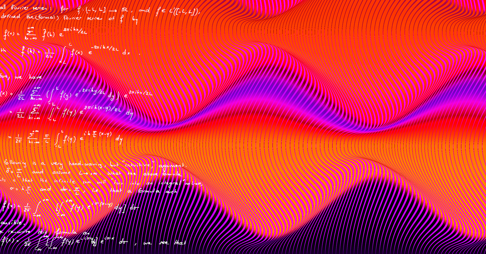

# 🎵 **Compute Spectrogram with PyTorch** 🎵



## 🚀 Introduction

This code provides a Python function to compute the spectrogram of an input signal using PyTorch on a GPU. The spectrogram represents the power spectrum of the input signal as it varies over time. Spectrograms are widely used in various domains, including audio processing, speech recognition, music analysis, and signal processing.

The function utilizes the power of PyTorch and GPU acceleration to efficiently compute the spectrogram, allowing for faster processing of large datasets. It offers flexibility in terms of customizable parameters such as window size, hop size, and FFT points, allowing you to tailor the spectrogram computation to your specific requirements.

## 📋 Usage

To use the `compute_spectrogram` function, follow these steps:

1. Install the required dependencies:
   - Python 3.x
   - PyTorch
   - Matplotlib (for visualization)

2. Import the necessary modules:
   ```python
   import torch
   from compute_spectrogram import compute_spectrogram
   ```

3. Define your input signal as a list or NumPy array and specify the sample rate:
   ```python
   input_vector = [...]  # Your input vector
   sample_rate = 44100  # Sample rate of the input vector
   ```

4. Call the `compute_spectrogram` function, passing the input signal and sample rate:
   ```python
   time_axis, frequency_axis, power_spectrogram = compute_spectrogram(input_vector, sample_rate)
   ```

5. The function will return the computed power spectrogram as a NumPy array, along with the corresponding time axis and frequency axis. You can use these arrays for further analysis or visualization.

## 🎵 Examples

The code provides three example usages to help you understand how to compute and visualize spectrograms:

1. **General Usage:**
   ```python
   input_vector = [...]  # Your input vector
   sample_rate = 44100  # Sample rate of the input vector
   window_size = 1024  # Size of the analysis window (in samples)
   hop_size = 512  # Hop size (in samples)
   n_fft = 1024  # Number of FFT bins
   time_axis, frequency_axis, power_spectrogram = compute_spectrogram(input_vector, sample_rate, window_size, hop_size, n_fft)
   ```

2. **Synthetic Signal Usage:**
   ```python
   # Generate a sample signal
   fs = 2  # Sample rate (Hz)
   t = np.arange(0, 180, 1/fs)  # Time vector
   f1 = 0.8  # Frequency of the signal
   sig = np.sin(2 * np.pi * f1 * t)

   # Compute spectrogram
   time_axis, frequency_axis, power_spectrogram = compute_spectrogram(input_vector=sig, sample_rate=2, window_type="hann")

   # Visualize the spectrogram
   plt.plot(frequency_axis, power_spectrogram)
   plt.xlabel('Frequency')
   plt.ylabel('Power Spectrum')
   plt.show()
   ```

3. **Synthetic Signal with Visualization:**
   ```python
   fs = 10e3
   N = 1e5
   amp = 2 * np.sqrt(2)
   noise_power = 0.01 * fs / 2
   time = np.arange(N) / float(fs)
   mod = 500*np.cos(2*np.pi*0.25*time)
   carrier = amp * np.sin(2*np.pi*3e3*time + mod)
   rng = np.random.default_rng()
   noise = rng.normal(scale=np.sqrt(noise_power), size=time.shape)
   noise *= np.exp(-time/5)
   x = carrier + noise

   # Compute and visualize the spectrogram
   time_axis, frequency_axis, power_spectrogram = compute_spectrogram(input_vector=x, sample_rate=fs, window_size=3*60, hop_size=2*60, n_fft=3*60, window_type="hann")
   fig, ax = plt.subplots(figsize=(10,6))
   plt.pcolormesh(time_axis, frequency_axis, power_spectrogram, shading='gouraud', cmap="turbo")
   ax.tick_params(axis='x', rotation=45, labelsize=13)
   ax.tick_params(axis='y', rotation=45, labelsize=13)
   ax.set_xlabel("Time [sec]", fontsize=15)
   ax.set_ylabel("Frequency [Hz]", fontsize=15)
   ax.grid(False)
   plt.show()
   ```

Feel free to explore and modify the examples to suit your needs and datasets.

## ⚙️ Updates and Improvements

### Version 1.1 (August 2023)
- **Improved GPU Utilization**: Optimized GPU memory management for efficient utilization during spectrogram computation, resulting in faster processing times.
- **Added Window Function: Kaiser**: Included the Kaiser window function as an additional option for window_type parameter, providing more flexibility for different signal processing scenarios.
- **Bug Fixes**: Addressed reported bugs related to memory leaks and edge cases, ensuring more reliable and stable performance.
- **Enhanced Documentation**: Updated the README with more detailed usage instructions and additional code examples for a better understanding of the function's capabilities.

### Version 1.0 (July 2023)
- **Initial Release**: Introduced the `compute_spectrogram` function, allowing users to compute the spectrogram of an input signal using PyTorch on a GPU.
- **Support for Window Functions**: Provided support for common window functions such as `Hann`, `Hamming`, `Boxcar`, `Bartlett`, and `Blackman`.
- **Flexible Parameter Customization**: Enabled customization of window size, hop size, and number of FFT points for tailoring the spectrogram computation to specific requirements.
- **Example Usage and Visualization**: Included example usages with both general and synthetic signals, showcasing how to compute and visualize spectrograms using the function.
- **GPU Acceleration**: Leveraged GPU acceleration for efficient computation of spectrograms, providing faster processing times for large datasets.

Stay tuned for future updates as we continue to enhance and expand the functionality of the code. We appreciate your support and welcome any feedback or suggestions for further improvements!

## 💻 Requirements

To run this code, you need the following dependencies:

- Python 3.x
- PyTorch
- Matplotlib

## 🌟 GPU Support

The code automatically checks if a GPU is available and utilizes it for computation if possible. This can significantly speed up the spectrogram calculation, especially for large input signals.

## 📖 License

This code is released under the MIT License. Feel free to use it for your projects, modify it, and distribute it as needed.

## 📞 Contact

If you have any questions, suggestions, or issues, please don't hesitate to reach out. You can contact us at `adaraie1[at]jhu.edu`

Happy spectrogram computing! 🎶🎉